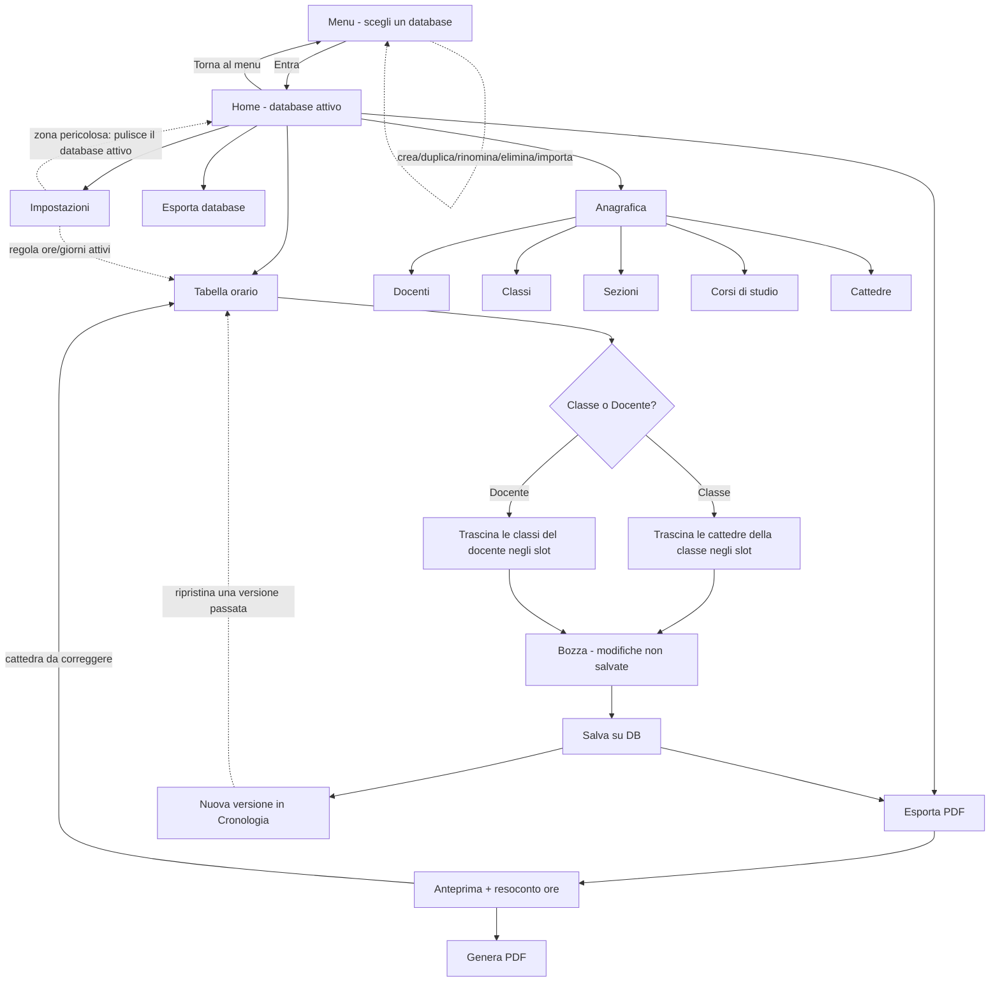

<p align="center">
  
</p>

<h1 align="center">School Grid</h1>

<p align="center">
  L'orario scolastico settimanale, costruito a mano - ma senza doverlo tenere tutto in testa.
</p>

---

**School Grid** è un'app desktop pensata per chi costruisce davvero l'orario di una scuola: un dirigente scolastico, o chi ne fa le veci (un docente delegato, di solito quello con più pazienza). Gestisce classi, docenti e cattedre, mette tutto in griglia trascinando - per classe o per docente, a scelta - e lo esporta in un PDF pronto da stampare e affiggere.

Gira in locale, dati su SQLite sul tuo computer: nessun account, nessun cloud, nessun abbonamento. Un solo utilizzatore, ma più database se servono - un file `.db` per anno scolastico, scelto da un menu all'avvio.

## Non è un generatore automatico

> L'app segnala i conflitti - docente doppio, classe doppia, giorno libero non rispettato - ma la decisione di dove mettere ogni ora resta **sempre** a chi costruisce l'orario.

Non è un capriccio filosofico: è la scelta di design che guida tutto il resto. Esistono strumenti che "generano" l'orario in automatico e ti restituiscono qualcosa che nessuno ha davvero deciso, difficile da giustificare quando arriva la prima richiesta di modifica. School Grid fa il contrario: costruisci tu, casella per casella, e l'app ti dice quando stai per combinare un pasticcio.

## Cosa c'è oggi

La parte anagrafica è pronta e sensata, non solo funzionante:

| Sezione | Cosa gestisce |
|---|---|
| **Docenti** | Nome, cognome, e le cattedre a cui sono assegnati |
| **Classi** | Anno (1-5) + Sezione + Corso di studio - così una 1A Scientifico non si confonde mai con una 1A Linguistico |
| **Sezioni** | "A", "B", "C"... come entità propria, non testo libero - niente più "a" vs "A" a spezzare i raggruppamenti |
| **Corsi di studio** | Scientifico, Linguistico, Classico... stessa logica delle Sezioni |
| **Cattedre** | Docente + classe + ore settimanali - niente materia: si sa già quante ore un docente fa in una classe, non serve altro |

Ogni cancellazione controlla se il record è ancora agganciato a qualcos'altro (una sezione usata in una classe non si cancella per sbaglio) e te lo dice per nome, non con un codice errore SQL. Tabelle filtrabili, form validati, tutto in italiano e pronto per altre lingue il giorno in cui servissero.

## Più database, uno per anno scolastico

All'avvio scegli con quale database lavorare - "2026/2027", "2027/2028", quanti ne servono - da un menu dedicato, prima ancora della schermata principale. Crea, duplica, rinomina, elimina o importa un database quando vuoi; ognuno è un file `.db` indipendente, così i dati di un anno non si mescolano mai con quelli di un altro. Il database attivo si può anche esportare (dalla sidebar, sotto "Esporta PDF") per tenerne una copia di backup o portarlo su un altro computer - viene proposto come `<nome>.school-grid`, riconoscibile a colpo d'occhio tra gli altri file. Un pulsante in barra laterale riporta al menu in qualsiasi momento, avvisando prima se ci sono modifiche non salvate in Tabella orario.

Ogni volta che salvi la Tabella orario, School Grid tiene anche una cronologia delle ultime 20 versioni di quel database - con un resoconto di cosa è cambiato rispetto alla versione precedente (ore aggiunte, rimosse, spostate) e la possibilità di tornare a una versione passata in qualsiasi momento.

## Il flusso, in breve



Il menu è il punto di ingresso ad ogni avvio, come la scelta del database in un videogioco - non si passa alla Home senza aver scelto (o confermato) un database. Le due modalità della Tabella orario (per classe o per docente) guardano gli stessi dati da due lenti diverse - una modifica fatta nell'una compare subito nell'altra. L'Anteprima PDF segnala anche le cattedre con ore in difetto o in eccesso rispetto al monte ore: da lì si torna con un clic direttamente alla classe da correggere.

## Cosa manca

Il grosso - griglia orario trascinabile, doppia modalità, validazione dei conflitti in tempo reale, esportazione PDF, più database indipendenti con cronologia e import/export - è già costruito ed è la ragione per cui il progetto esiste. In esplorazione, non ancora deciso nei dettagli: un motore di suggerimento deterministico (non un assistente AI/LLM) per completare una cattedra privilegiando ore consecutive ed evitando buche nell'orario di un docente.

## Lo stack, in breve

Nuxt 4 (Vue) per l'interfaccia, [Tauri 2](https://tauri.app) per impacchettarla come app desktop nativa (Rust sotto il cofano), SQLite locale per i dati, [Nuxt UI](https://ui.nuxt.com) + Tailwind per non reinventare i componenti. Niente backend, niente server: l'eseguibile e il suo database vivono sul tuo computer.

Per i dettagli tecnici - modello dati, convenzioni di codice, principi di lavoro - la fonte di verità è [`CLAUDE.md`](CLAUDE.md).

## Si parte così

```bash
npm install

# finestra nativa, con SQLite/dialog/filesystem funzionanti
npm run tauri dev
# oppure
npm run dev:tauri

# eseguibile finale
npm run tauri build
# oppure
npm run build:tauri

# eseguibile con un database Demo già pronto, per farlo provare a qualcuno
npm run build:tauri:demo
```

Il solo `npm run dev` apre l'app nel browser, ma senza i plugin Tauri (SQLite incluso) - utile per lavorare rapidamente sull'interfaccia, non per testare nulla che tocchi il database.
